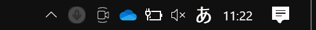
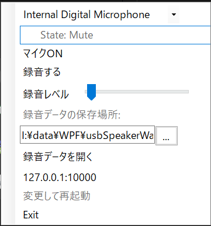

# triggerCam - シリアル通信撮影タスクトレイアプリ

**バージョン**: 1.0.0  
**更新日**: 2025年6月12日

シリアル通信で受信したトリガーに応じて、PC接続のWebカメラで**静止画**または**動画**を撮影・保存し、さらに保存完了時に**UDPで通知を送信する**タスクトレイ常駐型ユーティリティです。

## 概要

triggerCamは、シリアル通信（COMポート）経由で外部デバイスからのトリガー信号を受け取り、接続されたWebカメラで静止画撮影や動画録画を自動的に行うWindows用タスクトレイアプリケーションです。撮影完了時には指定したIPアドレス・ポートにUDP通知を送信することができます。

## 主な機能

- シリアル通信による遠隔トリガー
- 静止画撮影（PNG/JPEG形式）
- 動画録画（MP4形式、H.264エンコード）
- 撮影完了時のUDP通知
- タスクトレイ常駐型の軽量設計
- 多重起動防止機能

## ダウンロードとインストール

最新のリリース版は[こちら](https://github.com/Zukio/triggerCam/releases/latest)からダウンロードできます。

ダウンロードした ZIP ファイルを解凍し、`triggerCam.exe`を実行してください。

## バージョン（ブランチ）

- master: 公開ブランチ
- dev: 開発用／編集中の可能性があります【！】

## 使用方法

### シリアル通信によるトリガー

アプリケーションはシリアル通信ポートからの特定の文字列を監視し、以下のアクションを実行します：

- `START` - 動画録画開始
- `STOP` - 動画録画終了
- `SNAP` - 静止画撮影

### タスクトレイの操作

アプリケーションを起動すると、タスクトレイにアイコンが表示されます。このアイコンをクリックすると、設定メニューが表示されます：

 

### 主な設定項目

- **COMポート選択**: PC に接続されているシリアルポートの一覧が表示されます。
- **ボーレート設定**: シリアル通信のボーレートを設定できます（デフォルト: 9600bps）。
- **トリガー文字列**: 録画開始・停止・静止画撮影などのトリガー文字列を設定できます。
- **カメラ選択**: 使用するカメラデバイスを選択できます。
- **撮影モード**: 静止画撮影 / 動画録画モードを切り替えられます。
- **撮影データの保存場所**: 撮影ファイルの保存場所を設定できます。
- **撮影データを開く**: 保存場所をエクスプローラで開きます。
- **UDP送信先設定**: 通知先のUDPアドレスとポート番号を設定できます。
- **保存ボタン**: 変更した設定を保存します。
- **Exit ボタン**: アプリケーションを終了します。

### UDP通知機能

撮影の状態変化時に以下のメッセージがUDPで送信されます：

- カメラ接続: `Connected {deviceName}`
- カメラ切断: `disConnected`
- 撮影開始: `RecStart`
- 静止画撮影完了: `SnapSaved {imagePath}`
- 動画撮影停止: `RecStop {videoPath}`

### 外部からのコマンド制御

外部アプリケーションからUDPでJSONコマンドを送信して制御できます：

```json
{
  "command": "rec_start",
  "param": {
    "fileName": "video_20250612",
    "path": "C:/CustomVideos"
  }
}
```

#### コマンド一覧

- `take_snapshot`: 静止画を撮影します
  - パラメータ: `"fileName": "画像ファイル名"` (省略可)
- `rec_start`: 録画を開始します
  - パラメータ: `"fileName": "録画ファイル名"` (省略可)
- `rec_stop`: 録画を停止します
- `set_resolution`: カメラ解像度を設定します
  - パラメータ: "幅x高さ" (例: "1920x1080")
- `set_mode`: 撮影モードを設定します
  - パラメータ: "image"(静止画) または "video"(動画) (例: "image")
- `set_quality`: 画像品質を設定します
  - パラメータ: 1-100の数値 (例: "95")
- `set_format`: 静止画フォーマットを設定します
  - パラメータ: フォーマット名 (例: "png", "jpg")
- `get_settings`: 現在のカメラ設定を取得します
- `exit`: アプリケーションを終了します

#### カメラ設定変更の例

```json
// 解像度を設定
{
  "command": "set_resolution",
  "param": "1920x1080"
}

// フレームレートを設定
{
  "command": "set_framerate",
  "param": "60"
}

// 画像フォーマットを設定
{
  "command": "set_format",
  "param": "jpg"
}

// モードを静止画に設定
{
  "command": "set_mode",
  "param": "image"
}

// モードを動画に設定
{
  "command": "set_mode",
  "param": "video"
}

// 現在の設定を取得
{
  "command": "get_settings"
}
```

#### エラーレスポンス

コマンド実行時にエラーが発生した場合、以下のような形式でエラー情報が返されます：

```json
{
  "status": "error",
  "message": "エラーの詳細メッセージ"
}
```

主なエラーケース：

- カメラ操作失敗: デバイスへのアクセスエラーなど
- 撮影開始失敗: ディスク容量不足、権限エラーなど
- 既に録画中: 録画開始コマンドを重複実行
- 録画していない: 録画停止コマンドを録画していない状態で実行
- 不正なコマンド: 未知のコマンドや不正なパラメータ

#### コマンド送信例

```json
{
  "command": "camera_select",
  "param": "HD WebCam"
}
```

```json
{
  "command": "rec_start",
  "param": {
    "fileName": "video_20250612",
    "path": "C:/CustomVideos"
  }
}
```

```json
{
  "command": "snap",
  "param": "snapshot_20250612"  // ファイル名のみ指定（パスはデフォルト）
}
```

### 撮影機能

`rec_start`コマンドで録画を開始し、`rec_stop`コマンドで録画を停止できます。録画ファイルはMP4形式で保存され、以下の優先順位で保存場所が決定されます：

1. UDPのrec_startコマンドで指定されたパス
2. 起動時引数（/videosDir）で指定されたパス
3. 設定ファイルに保存された値
4. デフォルト値（実行パスのVideosフォルダ）

静止画の場合は`snap`コマンドを使用し、PNG/JPEG形式で保存されます。

ファイル名は以下の方法で指定できます：

- コマンドの`fileName`パラメータで指定
- コマンドのパラメータを文字列で直接指定
- 省略時は現在の日時（yyyyMMdd_HHmmss形式）を使用

### 起動時引数

アプリケーションの起動時に、以下の引数で監視対象のCOMポートやカメラデバイス、通信用のUDPアドレス、ファイルの保存場所を指定できます。

```powershell
triggerCam.exe /comPort="COM3" /baudRate="9600" /cameraName="HD WebCam" /videosDir="C:/Videos"
```

利用可能な引数：

- `/comPort="COM3"` - 使用するシリアルポート
- `/baudRate="9600"` - シリアル通信のボーレート
- `/cameraName="your-camera-name"` - 使用するカメラデバイス名
- `/udpTo="127.0.0.1:23456"` - 状態通知の送信先UDPアドレス
- `/udpListen="127.0.0.1:10001"` - コマンド受信用のUDPアドレス
- `/videosDir="C:/Videos"` - 撮影ファイルの保存場所

### 6. 多重起動制御

アプリケーションは多重起動を制御します。すでに起動中の場合、新たなインスタンスの起動は阻止されます。

### 7. ログ

実行 exe と同じディレクトリに、`ConsoleLogs`というディレクトリが自動で作成されます。アプリケーションの起動毎に、このディレクトリ内に日付をファイル名とするログファイルが作成され、各種情報やエラーメッセージが記録されます。

### エラーハンドリング

アプリケーションは以下のような状況でダイアログを表示します

【警告ダイアログ条件一覧】
カメラ未接続：「カメラが見つかりません。デバイスを確認してください。」
COMポート未選択 or 通信不能：「シリアル通信ポートが未接続です。設定を確認してください。」
録画中にSTOPが来ない：「録画停止トリガーが一定時間内に検出されません。録画を強制終了しますか？」など

アプリケーションは以下のような状況で適切なエラーハンドリングを実装しています：

- カメラデバイスの切断/再接続
- 撮影ファイルの保存失敗
- シリアル通信の切断/再接続
- UDPコマンドの不正な形式
- メモリリソースの管理
- ファイルシステムの操作エラー

エラーが発生した場合：

1. エラーログが記録されます
2. UDPコマンドの場合はエラーレスポンスが返されます
3. UIに適切なエラーメッセージが表示されます
4. 可能な場合は自動的にリカバリを試みます

## システム要件

- **オペレーティングシステム**: Windows 10/11 (64bit)
- **開発環境**: Visual Studio 2022
- **フレームワーク**: .NET 6.0, Windows Forms (WinForms)

## 開発者向け情報

このプロジェクトは Windows Forms（WinForms）アプリケーションとして開発されました。
WinFormsは、Windowsデスクトップアプリケーションを作成するための.NETフレームワークで、
特にシステムトレイアプリケーションの開発に適しています。

### 開発環境のセットアップ

1. プロジェクトをクローンまたはダウンロードします
2. Visual Studio 2022 でプロジェクトを開きます
3. 必要な依存関係や NuGet パッケージをインストールします

   ```powershell
   # NuGet パッケージのインストール
   Install-Package OpenCvSharp4 -Version 4.9.0
   Install-Package OpenCvSharp4.runtime.win -Version 4.9.0
   Install-Package System.IO.Ports -Version 8.0.0
   ```

4. ビルドして実行します

### セットアップスクリプト

開発環境を素早くセットアップするには、プロジェクトルートディレクトリで以下のスクリプトを実行します：

Windows:

```powershell
.\setup.ps1
```

Linux/Mac:

```bash
./setup.sh
```

このスクリプトは以下の処理を行います：

- 必要なNuGetパッケージのインストール確認
- プロジェクトディレクトリ構造の確認と作成
- プロジェクトのビルド

### 拡張機能（今後の開発予定）

- OCR処理との連携（文字抽出・アルファ画像生成の自動化）
- ファイルアップロード（FTP/SFTP/Google Driveなど）
- GUIでの録画ログ閲覧・フィルタリング
- WebSocket連携によるリアルタイムステータス監視

### 貢献

貢献は大歓迎です！バグ報告、新機能の提案など、どうぞお気軽に Issue を開いてください。
