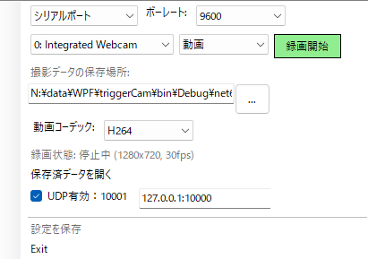

# 元・マイク状態通知アプリ ＞ シリアル通信で受信したトリガーに応じて、PC接続のWebカメラで静止画または動画を撮影・保存し、さらに保存完了時にUDPで通知を送信するタスクトレイ常駐型ユーティリティをC#で開発するためのひな型

元のアプリは、Windows PC に接続されているマイクの ON/OFF/Mute 状態を検知し、その状態変化を別のプログラムへ UDP で通知するためのバックグラウンドアプリケーションです。また、外部アプリケーションからの命令を受け取り、マイクの操作や録音を行うことができます。

## 新しいアプリの要件定義

``` md

# ■ 要件定義書 (Ver.1.2)

**プロジェクト名**: シリアル通信撮影タスクトレイアプリ
**更新日**: 2025年6月12日
**作成者**: Zukio

---

## 【目的】

シリアル通信で受信したトリガーに応じて、PC接続のWebカメラで**静止画**または**動画**を撮影・保存し、さらに保存完了時に**UDPで通知を送信する**タスクトレイ常駐型ユーティリティをC#で開発する。

---

## 【基本方針】

* 対応する撮影モード：

  * ✅ 静止画（PNG/JPEG）
  * ✅ 動画（MP4, H.264エンコード）
* 撮影制御はトリガーによる

  * `START` → 動画録画開始
  * `STOP` → 動画録画終了
* タスクトレイ常駐アプリとして軽量に動作
* 多重起動禁止（単一インスタンス）

---

## 【機能要件】

### 1. シリアル通信受信

| 機能              | 詳細                                    |
| --------------- | ------------------------------------- |
| COMポート列挙        | 起動時または再読み込みで現在接続されているCOMポート一覧を表示      |
| ボーレート設定         | 9600bps 固定 or GUIで選択（任意）              |
| トリガー文字列指定（自由形式） | START / STOP / SNAP など任意の文字列をGUIで設定可能 |
| 受信処理            | 非同期で受信し、トリガーに対応する動作をキューイング            |

---

### 2. 映像デバイス選択・撮影制御

| 機能            | 詳細                                                             |
| ------------- | -------------------------------------------------------------- |
| カメラデバイス列挙     | OpenCVで取得可能なVideoCaptureデバイスをリスト表示                             |
| プレビュー機能（任意）   | 必須ではないが、プレビュー用Windowを開く機能も実装可能（例: 320x240の確認画面）                |
| 静止画撮影         | トリガー受信時に1枚保存（保存形式: PNG/JPEG）                                   |
| 動画撮影          | STARTで録画開始、STOPで録画終了 → MP4で保存（指定FPS、H.264エンコード）                |
| 保存先パス・ファイル名制御 | GUIで保存ディレクトリを指定し、ファイル名はテンプレート（例: coaster\_yyyyMMdd\_HHmmss）に従う |
| カメラ未接続時の警告    | 起動時または録画開始時に、カメラ未接続の場合はダイアログで明示的に警告                            |

---

### 3. UDP通知機能

| 機能           | 詳細                               |
| ------------ | -------------------------------- |
| 通知先IP/PORT設定 | GUIからUDP送信先のIPアドレスとポート番号を指定可能    |
| 通知形式         | JSONまたはプレーンテキスト形式を選択可能           |
| 通知タイミング      | 録画完了時 / 静止画保存完了時 に以下のようなメッセージを送信 |

{ "type": "video_saved", "path": "C:/videos/coaster_20250612_113300.mp4" }

---

### 4. タスクトレイ機能

| 機能     | 詳細                                         |
| ------ | ------------------------------------------ |
| 常駐     | Windowsのタスクトレイに常駐。タスクバー表示は行わない             |
| メニュー構成 | 設定画面／ログ画面／撮影開始・停止／アプリ終了                    |
| ログ表示   | シリアル受信や撮影・保存・通知などの履歴をGUIで確認可能（ログファイル保存も検討） |

---

### 5. 多重起動制御

| 機能       | 詳細                                             |
| -------- | ---------------------------------------------- |
| 単一インスタンス | 起動時に既存のプロセスをチェックし、多重起動をブロック。必要に応じて既存インスタンスを前面化 |

---

## 【非機能要件】

| 項目         | 内容                                                               |
| ---------- | ---------------------------------------------------------------- |
| 対応OS       | Windows 10 / 11（64bit）                                           |
| 開発言語       | **C# (.NET 6〜8)**（WPFベース）                                        |
| カメラ制御ライブラリ | **OpenCvSharp4** または **AForge.NET / MediaFoundation**（性能比較のうえ選定） |
| 実行形式       | `.exe`（ClickOnce / インストーラ形式の提供も視野）                               |
| メモリ使用量     | 常駐時に50MB以下を目安                                                    |
| エラー処理      | COMポート切断、カメラ未検出時は自動復旧または警告表示で回避                                  |

---

## 【GUI要素一覧】

| 要素          | 内容                             |
| ----------- | ------------------------------ |
| COMポート選択    | 現在のシリアルポート一覧を表示、選択ドロップダウン      |
| トリガー文字列     | START / STOP / SNAP など任意指定     |
| カメラ選択       | 使用するカメラの選択（デバイス名表示）            |
| 撮影モード切替     | 静止画 / 動画（トグルまたはラジオボタン）         |
| 保存先フォルダ指定   | ファイル保存先のディレクトリパスをGUIで選択可能      |
| ファイル名テンプレート | coaster\_{yyyyMMdd\_HHmmss} など |
| UDP送信先設定    | IP\:PORT + 通知形式（JSON/プレーン）     |

---

## 【警告ダイアログ条件一覧】

| 条件                | 表示される警告文例                               |
| ----------------- | --------------------------------------- |
| カメラ未接続            | 「カメラが見つかりません。デバイスを確認してください。」            |
| COMポート未選択 or 通信不能 | 「シリアル通信ポートが未接続です。設定を確認してください。」          |
| 録画中にSTOPが来ない      | 「録画停止トリガーが一定時間内に検出されません。録画を強制終了しますか？」など |

---

## 【今後の拡張性】

* 🔜 OCR処理との連携（文字抽出・アルファ画像生成の自動化）
* 🔜 ファイルアップロード（FTP/SFTP/Google Driveなど）
* 🔜 GUIでの録画ログ閲覧・フィルタリング
* 🔜 WebSocket連携によるリアルタイムステータス監視
* 🔜 AIベースの不正トリガー検出（例：誤反応対策）

```

## ダウンロード

最新のリリース版は[こちら](https://github.com/あなたのGitHubユーザー名/リポジトリ名/releases/latest)からダウンロードできます。

ダウンロードした ZIP ファイルを解凍し、`micNotifyUDP.exe`を実行してください。

## バージョン（ブランチ）

- master: 公開ブランチ
- dev: 開発用／編集中の可能性があります【！】

## 元のアプリの主な機能

### 1. 基本メニュー

アプリケーションを起動すると、タスクバーにアイコンが表示されます。このアイコンをクリックすると、以下のメニュー項目が展開します。




- **マイクリスト**: PC に接続されているマイクの一覧が表示されます。このアプリで監視するマイクを選択できます（システムのデフォルトマイクとは独立して動作します）。
- **マイク状態**: 選択中のマイクの接続（ON/OFF/Mute）状態を表示・変更します。
- **録音する／録音停止**
  - **録音レベル**: 録音時の無音判定閾値を設定できます。
  - **一時ファイルを使用する**: 一時ディレクトリにファイル保存
    - **録音データの保存場所**: 録音ファイルの保存場所を設定できます。
    - **録音データを開く**:  録音ファイルの保存場所をエクスプローラで開きます
- **UDP アドレス**: 通知先の UDP アドレスを設定できます。
- **変更して再起動ボタン**: 変更を保存します。
- **Exit ボタン**: アプリケーションを終了します。

注意：このアプリケーションで選択するマイクデバイスは、システムのデフォルトマイクデバイスとは独立して動作します。例えば、システムでヘッドセットのマイクをデフォルトとして使用しながら、このアプリでは別のUSBマイクの状態を監視するといった使い方ができます。

### 2. UDP 通信（状態通知）

オーディオの状態の変化を検知すると、以下のメッセージが UDP で送信されます。

- 接続: `Connected {deviceName}`
- 接続解除: `disConnected`
- Mute/Off: `isMute`
- ON: `ON`
- 監視デバイス変更: `Changed {deviceName}`
- 録音開始: `RecStart`
- 録音停止: `RecStop {recordedFilePath}`

### 3. 外部からのコマンド受信

外部アプリケーションからUDPを通じてコマンドを受信し、マイクの操作や録音を行うことができます。コマンドはJSON形式で送信します。

#### コマンド一覧

| コマンド | 説明 | パラメータ | レスポンス |
|---------|------|-----------|-----------|
| `exit` | アプリケーションを終了する | なし | `{"status":"success","message":"Application will exit"}` |
| `mic_on` | マイクをONにする | なし | `{"status":"success","message":"Microphone turned on"}` |
| `mic_mute` | マイクをミュートにする | なし | `{"status":"success","message":"Microphone muted"}` |
| `mic_status` | マイクの状態を取得する | なし | `{"status":"success","message":"Microphone is on/muted","data":{"isMuted":false/true}}` |
| `rec_start` | 録音を開始する | ファイル名と保存パス（省略可） | `{"status":"success","message":"Recording started","data":{"fileName":"ファイル名","path":"保存パス"}}` |
| `rec_stop` | 録音を停止する | なし | `{"status":"success","message":"Recording stopped","data":{"filePath":"録音ファイルのパス","isEmpty":false}}` |

#### エラーレスポンス

コマンド実行時にエラーが発生した場合、以下のような形式でエラー情報が返されます：

```json
{
  "status": "error",
  "message": "エラーの詳細メッセージ"
}
```

主なエラーケース：

- マイク操作失敗: デバイスへのアクセスエラーなど
- 録音開始失敗: ディスク容量不足、権限エラーなど
- 既に録音中: 録音開始コマンドを重複実行
- 録音していない: 録音停止コマンドを録音していない状態で実行
- 不正なコマンド: 未知のコマンドや不正なパラメータ

#### コマンド送信例

```json
{
  "command": "mic_on"
}
```

```json
{
  "command": "rec_start",
  "param": {
    "fileName": "recording_20250304",
    "path": "C:/CustomRecordings"
  }
}
```

```json
{
  "command": "rec_start",
  "param": "recording_20250304"  // ファイル名のみ指定（パスはデフォルト）
}
```

### 4. 録音機能

`rec_start`コマンドで録音を開始し、`rec_stop`コマンドで録音を停止できます。録音ファイルはWAV形式で保存され、以下の優先順位で保存場所が決定されます：

1. UDPのrec_startコマンドで指定されたパス
2. 起動時引数（/recordingsDir）で指定されたパス
3. 設定ファイルに保存された値
4. デフォルト値（実行パスのRecordingsフォルダ）

録音ファイル名は以下の方法で指定できます：

- `rec_start`コマンドの`fileName`パラメータで指定
- `rec_start`コマンドのパラメータを文字列で直接指定
- 省略時は現在の日時（yyyyMMdd_HHmmss形式）を使用

無音判定：

- 設定された閾値以下の音声レベルが続く場合、その部分は録音されません
- 閾値はUIのスライダーで調整可能
- 設定は保存され、次回起動時も維持されます

### 5. 起動時引数

アプリケーションの起動時に、以下の引数で監視対象のデバイス名や通信用のUDPアドレス、録音ファイルの保存場所を指定できます。

- `/deviceName="your-device-name"` - 監視対象のデバイス名
- `/udpTo="127.0.0.1:23456"` - 状態通知の送信先UDPアドレス
- `/udpListen="127.0.0.1:10001"` - コマンド受信用のUDPアドレス
- `/recordingsDir="C:/Recordings"` - 録音ファイルの保存場所

### 6. 多重起動制御

アプリケーションは多重起動を制御します。すでに起動中の場合、新たなインスタンスの起動は阻止されます。

### 7. ログ

実行 exe と同じディレクトリに、`ConsoleLogs`というディレクトリが自動で作成されます。アプリケーションの起動毎に、このディレクトリ内に日付をファイル名とするログファイルが作成され、各種情報やエラーメッセージが記録されます。

### 8. エラーハンドリング

アプリケーションは以下のような状況で適切なエラーハンドリングを実装しています：

- マイクデバイスの切断/再接続
- 録音ファイルの保存失敗
- UDPコマンドの不正な形式
- メモリリソースの管理
- ファイルシステムの操作エラー

エラーが発生した場合：

1. エラーログが記録されます
2. UDPコマンドの場合はエラーレスポンスが返されます
3. UIに適切なエラーメッセージが表示されます
4. 可能な場合は自動的にリカバリを試みます

### システム要件

- **オペレーティングシステム**: Windows
- **開発環境**: Visual Studio 2022
- **フレームワーク**: .NET Core, Windows Forms (WinForms)

## 開発者向け情報

このプロジェクトは Windows Forms（WinForms）アプリケーションとして開発されました。
WinFormsは、Windowsデスクトップアプリケーションを作成するための.NETフレームワークで、
特にシステムトレイアプリケーションの開発に適しています。

開発環境は Visual Studio 2022 です。

### インストール

1. プロジェクトをカスタマイズするには、このリポジトリをクローンまたはダウンロードします。
2. Visual Studio 2022 でプロジェクトを開きます。
3. 必要な依存関係や NuGet パッケージをインストールします。
   - NuGet パッケージ: NAudio
4. ビルドして実行します。

### 貢献

貢献は大歓迎です！バグ報告、新機能の提案など、どうぞお気軽に Issue を開いてください。
